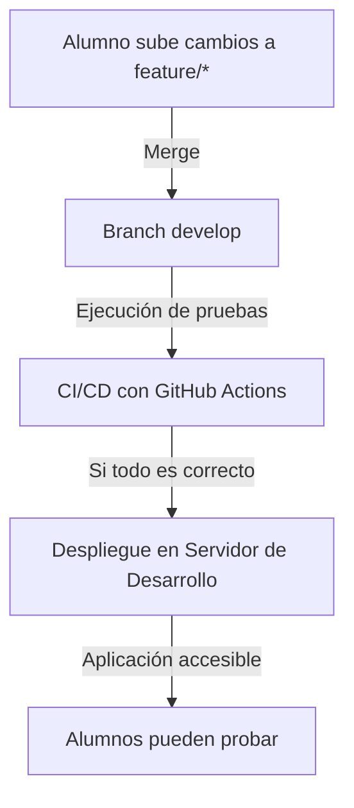
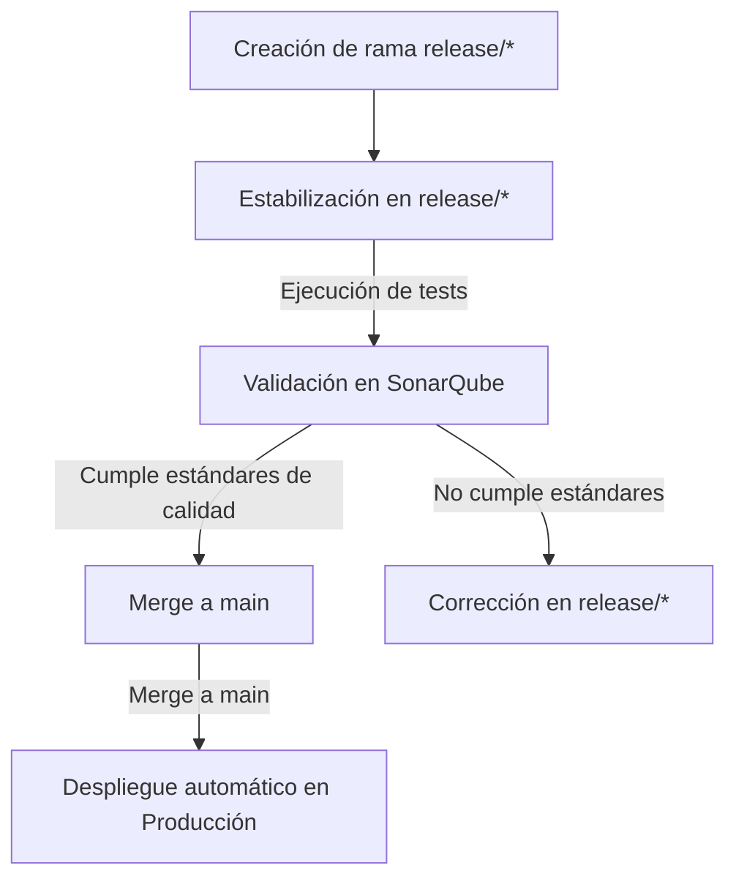

## 🚀 **Flujo de Despliegue en el Curso**

En este curso, nuestra aplicación seguirá un **flujo de despliegue estructurado** que permitirá a los alumnos trabajar en sus funcionalidades, validar los cambios y desplegar la aplicación en diferentes entornos.

🔹 **La aplicación se desplegará en:**  
1️⃣ **Entorno Local:** Ejecutando la aplicación junto con una base de datos en **Docker Compose**.  
2️⃣ **Entorno de Desarrollo:** Cada vez que un alumno haga un `merge` a `develop`, se ejecutarán pruebas y, si todo es correcto, se desplegará automáticamente en un servidor accesible.  
3️⃣ **Entorno de Producción:** Se podría configurar un despliegue final cuando la aplicación esté lista.

---

## 📌 **1️⃣ Despliegue en Local con Docker Compose**

Cada alumno podrá ejecutar la aplicación en su entorno local utilizando **Docker Compose**.

📌 **Pasos para ejecutar en local:**  
1️⃣ Clonar el repositorio:
```bash
git clone https://github.com/ateixeiramunoz/leccionesdegit.git
cd leccionesdegit
```
2️⃣ Construir y ejecutar los contenedores:
```bash
docker-compose up --build
```
3️⃣ Acceder a la aplicación:
- Backend: `http://localhost:8080`
- Base de datos: `localhost:5432`

📌 **Ejemplo del `docker-compose.yml` para local:**
```yaml
version: '3.8'
services:
  db:
    image: postgres:15
    environment:
      POSTGRES_DB: lecciones_git
      POSTGRES_USER: user
      POSTGRES_PASSWORD: password
    ports:
      - "5432:5432"
  app:
    build: .
    depends_on:
      - db
    ports:
      - "8080:8080"
    environment:
      SPRING_DATASOURCE_URL: jdbc:postgresql://db:5432/lecciones_git
      SPRING_DATASOURCE_USERNAME: user
      SPRING_DATASOURCE_PASSWORD: password
```

✅ **Beneficios:**  
✔️ Facilita la ejecución sin necesidad de configurar manualmente la base de datos.  
✔️ Todos los alumnos trabajan en el mismo entorno.

---

## 📌 **2️⃣ Despliegue en Entorno de Desarrollo (CI/CD Automático)**

Cada vez que se haga un `merge` a `develop`, el código se **compilará, se ejecutarán pruebas y se desplegará automáticamente** en un entorno accesible para los alumnos.

📌 **Flujo Automático de Despliegue:**


📌 **Configuración del Pipeline en GitHub Actions (`.github/workflows/deploy.yml`)**
```yaml
name: Deploy to Development
on:
  push:
    branches:
      - develop
jobs:
  test:
    runs-on: ubuntu-latest
    steps:
      - name: Checkout código
        uses: actions/checkout@v3
      - name: Build & Test
        run: mvn clean test
  deploy:
    needs: test
    runs-on: ubuntu-latest
    steps:
      - name: Build Docker Image
        run: docker build -t lecciones-git .
      - name: Push Image to Docker Hub
        run: docker tag lecciones-git usuario/lecciones-git && docker push usuario/lecciones-git
      - name: Deploy on Server
        run: ssh usuario@servidor "docker-compose pull && docker-compose up -d"
```

📌 **Servidor de Desarrollo:**
- `develop` se despliega automáticamente.
- Se puede acceder a la aplicación en `https://desarrollo.leccionesgit.com`.

✅ **Beneficios:**  
✔️ Permite que todos los alumnos prueben sus cambios en un entorno centralizado.  
✔️ Detecta errores antes de fusionar cambios en `main`.

---

## 📌 **3️⃣ Despliegue en Producción**

(📌 *Establecido como un despliegue semanal con control de calidad.*)

📌 **Flujo de Producción:**  
1️⃣ **Creación de una Rama de Release:** Los alumnos, con apoyo de las tutorías, crearán ramas de **release** a partir
de la rama `develop`, donde estabilizarán los cambios.  
2️⃣ **Validación de Código:** Antes del despliegue, el código de la rama de **release** pasará por un proceso de
validación:

- Ejecución de todos los **tests automáticos**.
- Validación en **SonarQube** para verificar la calidad del código, cobertura de pruebas y detectar errores o problemas
  críticos.
- Si no cumple los estándares de calidad, la rama será rechazada hasta que se corrijan los problemas.  
  3️⃣ **Despliegue Semanal:** Una vez que se valida la rama de release, esta se mezcla (`merge`) en la rama de
  producción (`main`), y la aplicación se despliega automáticamente en el servidor de producción con datos estables.

📌 **Pasos del Proceso:**



📌 **Configuración del Pipeline para Validación y Despliegue (`.github/workflows/production.yml`)**

```yaml
name: Deploy to Production
on:
  push:
    branches:
      - main
      - release/*
jobs:
  validate:
    runs-on: ubuntu-latest
    steps:
      - name: Checkout código
        uses: actions/checkout@v3
      - name: Ejecutar Tests
        run: mvn clean test
      - name: Análisis de Calidad (SonarQube)
        env:
          SONAR_TOKEN: ${{ secrets.SONAR_TOKEN }}
        run: mvn sonar:sonar -Dsonar.projectKey=leccionesdegit
  deploy:
    needs: validate
    runs-on: ubuntu-latest
    steps:
      - name: Build Docker Image
        run: docker build -t lecciones-git .
      - name: Push Image to Docker Hub
        run: docker tag lecciones-git usuario/lecciones-git && docker push usuario/lecciones-git
      - name: Deploy on Production Server
        run: ssh usuario@servidor "docker-compose pull && docker-compose up -d"
```

📌 **Acceso al Servidor de Producción:**

- Se podrá acceder a la aplicación en `https://eoijava.ddns.net:808x` donde `x` corresponderá al número de grupo

✅ **Beneficios:**  
✔️ Despliegue de versiones controladas y estables en un entorno seguro.  
✔️ Garantía de cumplimiento de estándares de calidad antes de publicar nuevas versiones.  
✔️ Despliegue regular para que todas las versiones estén alineadas con el flujo de desarrollo.

---

## 📜 **Resumen del Flujo de Despliegue**

| 🌍 Entorno | 🚀 Método de Despliegue | 📌 Acceso |
|------------|----------------|--------------|
| **Local** | `docker-compose up --build` | `http://localhost:8080` |
| **Desarrollo** | CI/CD con GitHub Actions | `https://desarrollo.leccionesgit.com` |
| **Producción (opcional)** | Manual o CI/CD con aprobación | `https://app.leccionesgit.com` |

---

📌 **Siguientes Pasos:**
- Probar el entorno local con `docker-compose`.
- Hacer un `merge` a `develop` y verificar que la aplicación se despliega correctamente.

---

⬅️ **Anterior: [Estrategias de Despliegue](07_ESTRATEGIAS_DE_DESPLIEGUE.md)**  
📌 **Siguiente: [Gestión de Versiones con Git](08_GESTION_DE_VERSIONES.md) →**

---

✅ **Este documento ya está listo para `documentacion/07A_FLUJO_DE_DESPLIEGUE_DEL_CURSO.md`** 🚀  
💡 **¿Quieres hacer algún ajuste antes de continuar con el siguiente?** 😃

