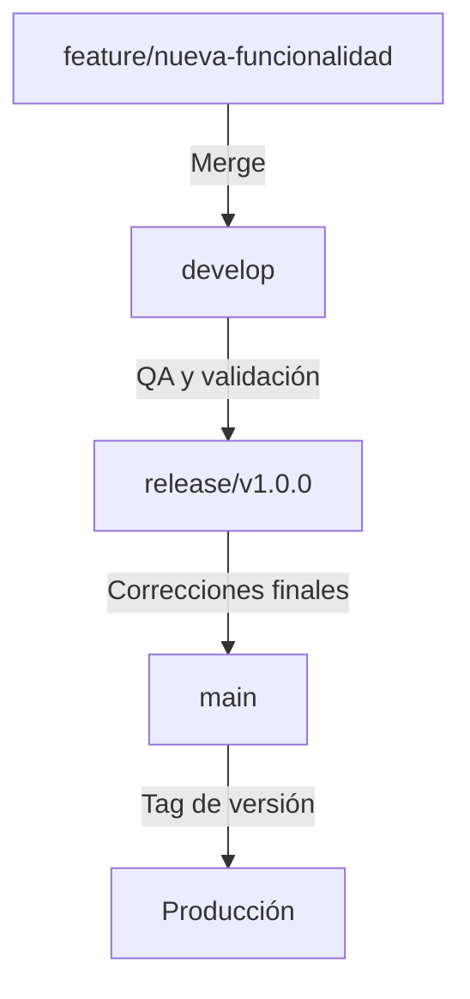

¡Entendido! Continuemos con el **Documento 08: Gestión de Versiones con Git**, asegurándonos de que sigue la estructura correcta y enlaza adecuadamente con los documentos anteriores.

---

# 📄 **08_GESTIÓN DE VERSIONES CON GIT**

## 📌 **Introducción**

La gestión de versiones en un proyecto es fundamental para:

✔️ **Mantener un historial claro de cambios**.  
✔️ **Facilitar la colaboración entre desarrolladores**.  
✔️ **Administrar diferentes versiones y lanzamientos del software**.

En este curso utilizamos **Git** junto con **GitHub**, asegurando un flujo de trabajo eficiente e integrado con herramientas como **Jira** para la gestión de tareas y **GitHub Actions** para la automatización de pruebas y despliegue.

📌 **En este documento aprenderás:**  
🔹 Las estrategias de versionado utilizadas en el curso.  
🔹 Cómo estructurar correctamente el historial de cambios.  
🔹 Cómo realizar lanzamientos de versiones estables (`release/*`).  
🔹 Cuándo y cómo aplicar `merge`, `rebase`, `tagging` y `hotfixes`.

🔗 **Antes de continuar, revisa:**  
➡️ [07A - Flujo de Despliegue del Curso](07A_FLUJO_DE_DESPLIEGUE_DEL_CURSO.md)

---

## 🔄 **1️⃣ Estrategia de Versionado en el Curso**

Para garantizar un desarrollo organizado, seguimos un modelo basado en **Versionado Semántico (`SemVer`)** con ramas estructuradas:

| 🌳 Rama | 📌 Propósito | 🚀 Despliegue |
|---------|------------|--------------|
| **`main`** | Código estable y en producción. | 🔥 Despliegue final |
| **`develop`** | Integración de nuevas funcionalidades antes de `main`. | 🚀 Servidor de desarrollo |
| **`feature/*`** | Implementación de nuevas funcionalidades. | 🛠️ Solo local |
| **`release/*`** | Preparación de versiones estables. | ✅ QA y validación |
| **`hotfix/*`** | Correcciones urgentes de errores en producción. | ⚡ Corrección rápida |

🔹 **Ejemplo de flujo de versiones:**


---

## 📌 **2️⃣ Versionado Semántico (`SemVer`)**

📌 **Todas las versiones en este curso siguen el formato:**
```
v<MAJOR>.<MINOR>.<PATCH>
```
🔹 **Ejemplo de nombres de versiones:**
- `v1.0.0` → Primera versión estable.
- `v1.1.0` → Nueva funcionalidad agregada.
- `v1.0.1` → Corrección menor de errores.

📌 **Reglas de `SemVer`:**
- **`MAJOR`**: Se incrementa cuando hay cambios incompatibles con versiones anteriores.
- **`MINOR`**: Se incrementa cuando se añaden nuevas funcionalidades sin romper compatibilidad.
- **`PATCH`**: Se incrementa cuando se realizan correcciones de errores.

🔗 **Para más información sobre estrategias de versiones:**  
➡️ [07 - Estrategias de Despliegue](07_ESTRATEGIAS_DE_DESPLIEGUE.md)

---

## 📌 **3️⃣ Cómo Crear una Nueva Versión (`release/*`)**

Cuando se ha completado un conjunto de funcionalidades en `develop`, se crea una rama de **release** para preparar el lanzamiento.

### 🚀 **Pasos para una Versión Nueva:**

1️⃣ Crear la rama de release desde `develop`:
```sh
git checkout develop
git pull origin develop
git checkout -b release/v1.0.0
```
2️⃣ Aplicar los cambios finales y correcciones necesarias.  
3️⃣ Fusionar la rama en `main` y etiquetar la versión:
```sh
git checkout main
git merge release/v1.0.0
git tag -a v1.0.0 -m "Versión 1.0.0 estable"
git push origin v1.0.0
```
4️⃣ Eliminar la rama de `release/*` tras su fusión:
```sh
git branch -d release/v1.0.0
git push origin --delete release/v1.0.0
```

✅ **Beneficios de usar `release/*`:**  
✔️ Facilita la estabilización de código antes del despliegue.  
✔️ Permite realizar pruebas en QA antes de llegar a producción.

---

## 📌 **4️⃣ Hotfixes: Corrección de Errores en Producción**

Si se detecta un error crítico en producción, se debe corregir de inmediato sin afectar `develop`. Para ello, se usa una rama `hotfix/*`.

### 🚨 **Pasos para un Hotfix:**

1️⃣ Crear la rama `hotfix/*` desde `main`:
```sh
git checkout main
git pull origin main
git checkout -b hotfix/v1.0.1
```
2️⃣ Aplicar la corrección y hacer commit:
```sh
git add .
git commit -m "Hotfix: corrección del error en producción"
```
3️⃣ Fusionar en `main` y etiquetar la versión:
```sh
git checkout main
git merge hotfix/v1.0.1
git tag -a v1.0.1 -m "Corrección rápida en producción"
git push origin v1.0.1
```
4️⃣ Fusionar también en `develop` para evitar que el error reaparezca:
```sh
git checkout develop
git merge hotfix/v1.0.1
git push origin develop
```
5️⃣ Eliminar la rama `hotfix/*`:
```sh
git branch -d hotfix/v1.0.1
git push origin --delete hotfix/v1.0.1
```

✅ **Beneficios de `hotfix/*`:**  
✔️ Permite corregir errores sin afectar el desarrollo en `develop`.  
✔️ Mantiene la estabilidad de `main`.

---

## 🔄 **5️⃣ Comparación: `merge` vs `rebase` en la Gestión de Versiones**

| 🔹 Método | 📌 Cuándo Usarlo | ⚠️ Cuándo Evitarlo |
|-----------|----------------|--------------------|
| **`merge`** | Fusionar cambios entre ramas sin reescribir historial. | Si quieres un historial más limpio sin commits de merge adicionales. |
| **`rebase`** | Mover una rama encima de otra para evitar bifurcaciones. | En ramas compartidas, ya que puede cambiar el historial y causar conflictos. |

📌 **Para más detalles sobre `rebase`:**  
➡️ [05 - Rebase y sus Riesgos](05_REBASE_PELIGROSO.md)

---

## 🎯 **Conclusión: Buenas Prácticas en la Gestión de Versiones**

✔️ **Utilizar `feature/*`, `release/*` y `hotfix/*` para estructurar el desarrollo.**  
✔️ **Aplicar Versionado Semántico (`SemVer`) para gestionar lanzamientos.**  
✔️ **Fusionar cambios de `hotfix/*` en `develop` para evitar errores recurrentes.**  
✔️ **Usar `merge` para integrar cambios y `rebase` solo en ramas privadas.**  
✔️ **Etiquetar (`tag`) cada versión estable en `main` para un historial claro.**

📌 **Siguiendo estas prácticas, garantizamos un desarrollo organizado, colaborativo y eficiente.** 🚀

---

⬅️ **Anterior: [07 - Estrategias de Despliegue](07_ESTRATEGIAS_DE_DESPLIEGUE.md)**  
📌 **Siguiente: [09 - Cherry-Picking y Gestión de Parches](09_CHERRY_PICKING_Y_PARCHES.md) →**


