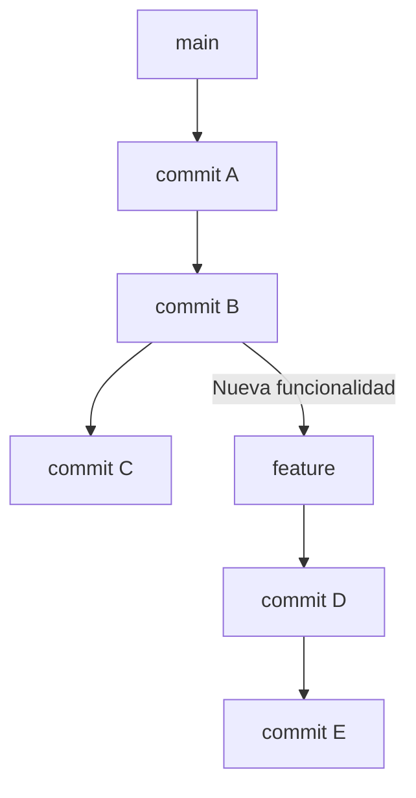

¡Genial! Vamos a desarrollar el documento **09 - Cherry-Picking y Gestión de Parches**. Este documento explicará cómo extraer cambios específicos de una rama sin necesidad de fusionarla completamente, algo útil en escenarios donde se requieren **hotfixes** o correcciones puntuales.

---

# 📄 **09_CHERRY_PICKING_Y_GESTION_DE_PARCHES.md**

## 📌 **Introducción**

A lo largo del desarrollo de software, es común encontrar situaciones donde un cambio realizado en una rama específica debe aplicarse a otra sin realizar un `merge` completo. Esto ocurre, por ejemplo, cuando:

✔️ Se necesita aplicar un **hotfix** a `main` sin incluir cambios adicionales de `develop`.  
✔️ Un cambio realizado en una rama `feature` debe trasladarse a otra rama sin fusionar todo su contenido.  
✔️ Se debe extraer una corrección de `develop` y aplicarla en una versión de producción (`release/*`).

Para estos casos, Git proporciona un comando muy útil:

```sh
git cherry-pick <commit>
```
Este comando permite aplicar un **commit específico** a otra rama sin necesidad de fusionar todo su historial.

🔗 **Antes de continuar, revisa:**  
➡️ [08 - Gestión de Versiones con Git](08_GESTION_DE_VERSIONES.md)

---

## 🔄 **1️⃣ ¿Qué es `git cherry-pick` y para qué sirve?**

El comando `cherry-pick` se usa cuando queremos copiar cambios específicos de una rama a otra.

📌 **Ejemplo de Escenario:**

En este caso, imaginemos que **el commit `D`** introduce una mejora que queremos llevar a `main`, pero sin incluir `E`.

### **Ejecutamos:**
```sh
git checkout main
git cherry-pick <ID_DE_COMMIT_D>
```

📌 **Resultado después del `cherry-pick`:**
- `D` se aplicará en `main`, pero `E` quedará en `feature`.
- No se fusionará el resto de la rama `feature`.

✅ **Ventajas de `cherry-pick`:**  
✔️ Permite aplicar cambios específicos sin afectar el historial completo.  
✔️ Es útil para hotfixes y migración de pequeñas mejoras.

❌ **Riesgos:**  
⚠️ Si `D` dependía de cambios en `E`, es posible que haya errores o conflictos.  
⚠️ Puede generar duplicación de commits en el historial si no se usa con cuidado.

---

## 📌 **2️⃣ Cómo Usar `git cherry-pick`**

### **A) Aplicar un Solo Commit**

Si sabemos el ID de un commit específico (`abc123`), lo aplicamos en nuestra rama actual:

```sh
git checkout main
git cherry-pick abc123
```
Esto tomará los cambios del commit `abc123` y los aplicará en `main`.

📌 **Verificación:**
```sh
git log --oneline --graph
```
Esto mostrará el nuevo commit en la rama `main`.

---

### **B) Aplicar Múltiples Commits**

Si necesitamos aplicar **varios commits seguidos**, podemos usar un rango:

```sh
git cherry-pick abc123..xyz789
```
Esto aplicará **todos los commits desde `abc123` hasta `xyz789`**.

---

### **C) Manejo de Conflictos en `cherry-pick`**

Si los cambios en el commit que estamos aplicando entran en conflicto con el código actual de la rama, Git pausará la operación y solicitará resolver el conflicto.

📌 **Pasos para solucionar conflictos:**  
1️⃣ Git mostrará los archivos en conflicto con `git status`.  
2️⃣ Edita los archivos para resolver el conflicto.  
3️⃣ Marca el conflicto como resuelto y añade los archivos:
```sh
git add .
git cherry-pick --continue
```
4️⃣ Si decides cancelar el `cherry-pick`:
```sh
git cherry-pick --abort
```

---

## 📌 **3️⃣ Uso de `cherry-pick` en Hotfixes y Versionado**

📌 **Ejemplo de aplicación en un `hotfix`:**

1️⃣ Un error crítico se detecta en `main`.  
2️⃣ Se corrige en `develop` y se confirma el commit (`fix-bug123`).  
3️⃣ Como el error debe solucionarse en `main`, hacemos un `cherry-pick`:
```sh
git checkout main
git cherry-pick fix-bug123
git push origin main
```

📌 **Ejemplo de aplicación en una `release` estable:**

1️⃣ Una mejora implementada en `develop` también debe aplicarse en `release/v1.0.0`.  
2️⃣ Extraemos el commit de `develop` y lo llevamos a `release/*`:
```sh
git checkout release/v1.0.0
git cherry-pick <commit-id>
git push origin release/v1.0.0
```

✅ **Esto permite actualizar la versión estable sin fusionar toda la rama `develop`.**

---

## 🔄 **4️⃣ Alternativa: `git format-patch` y `git am`**

Otra forma de mover cambios entre ramas es con **parches (`patches`)**.

📌 **Ejemplo de uso:**

1️⃣ Generamos un parche del commit:
```sh
git format-patch -1 <commit-id>
```
Esto crea un archivo `.patch` con los cambios del commit.

2️⃣ Aplicamos el parche en otra rama:
```sh
git am <archivo.patch>
```

📌 **Diferencias con `cherry-pick`:**  
✔️ `cherry-pick` crea un nuevo commit con el mismo cambio.  
✔️ `format-patch` permite enviar cambios a otros equipos sin acceso al repositorio.

---

## 🎯 **Conclusión: Cuándo Usar `cherry-pick`**

| 🚀 Caso de Uso | ✅ Cuándo Usarlo | ⚠️ Cuándo Evitarlo |
|---------------|----------------|--------------------|
| **Aplicar hotfixes** | Cuando un error corregido en `develop` debe llegar a `main`. | Si el commit depende de otros cambios. |
| **Migrar mejoras entre versiones** | Cuando un cambio en `develop` debe llegar a `release/*`. | Si la funcionalidad es muy grande. |
| **Extraer cambios de una rama sin fusionarla** | Si solo necesitamos un commit de `feature/*` sin traer todo su historial. | Si `merge` es más eficiente. |

📌 **Regla de oro:** Usa `cherry-pick` para aplicar cambios pequeños y puntuales.  
Si necesitas traer una funcionalidad completa, considera `merge` o `rebase`.

---

⬅️ **Anterior: [08 - Gestión de Versiones con Git](08_GESTION_DE_VERSIONES.md)**  
📌 **Siguiente: [10 - Integración Continua con GitHub Actions](10_CI_CD_GITHUB_ACTIONS.md) →**

