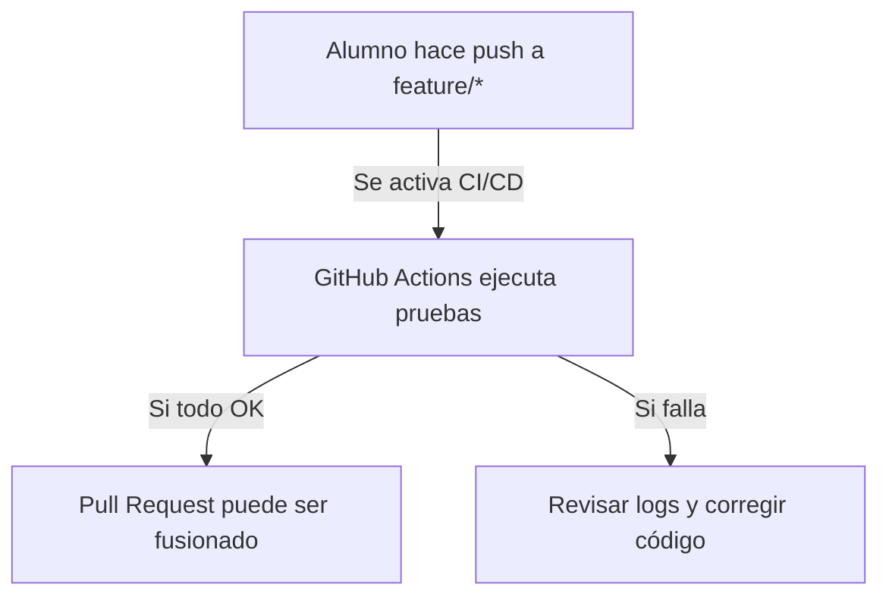

**¡Buena observación! Vamos a reorientar el documento **10 - Integración Continua con GitHub Actions** para centrarnos en **cómo los alumnos pueden utilizar GitHub Actions**, en lugar de configurarlo desde cero.

---

# 📄 **10_INTEGRACION_CONTINUA_GITHUB_ACTIONS.md**

## 📌 **Introducción**

En este curso, **GitHub Actions** se utiliza para **automatizar la ejecución de pruebas, verificar la calidad del código y desplegar la aplicación** en entornos de desarrollo y producción.

📌 **Como alumno, no necesitas configurar GitHub Actions**, pero sí debes saber **cómo interpretar los resultados y solucionar errores** cuando ocurran.

En este documento aprenderás:  
✅ **Cómo ver el estado de las ejecuciones en GitHub.**  
✅ **Cómo interpretar los logs de ejecución.**  
✅ **Qué hacer si tu código no pasa las validaciones.**

🔗 **Antes de continuar, revisa:**  
➡️ [09 - Cherry-Picking y Gestión de Parches](09_CHERRY_PICKING_Y_PARCHES.md)

---

## 🔍 **1️⃣ Dónde Ver las Ejecuciones de GitHub Actions**

📌 **Cada vez que subes código (`push`) o creas un `Pull Request`, GitHub ejecuta automáticamente las pruebas y validaciones.**

Para ver si todo ha ido bien:

1️⃣ Ir al repositorio en GitHub.  
2️⃣ Hacer clic en la pestaña **Actions**.  
3️⃣ Buscar la última ejecución en la lista de workflows.  
4️⃣ Si tiene un ✅ **(verde)** significa que todo ha salido bien.  
5️⃣ Si tiene una ❌ **(roja)** significa que ha habido un fallo.

📌 **Ejemplo de cómo se ve un workflow en GitHub Actions:**



---

## 📌 **2️⃣ Cómo Interpretar los Logs de GitHub Actions**

Si una ejecución ha fallado, hay que revisar **los logs** para encontrar la causa del error.

📌 **Pasos para revisar logs:**  
1️⃣ Ir a la pestaña **Actions** en el repositorio.  
2️⃣ Hacer clic en la ejecución fallida (aparecerá en rojo ❌).  
3️⃣ En la parte izquierda, se ven los pasos que GitHub ejecutó.  
4️⃣ Hacer clic en el paso que falló para ver el error exacto.

📌 **Errores Comunes y Cómo Solucionarlos:**

| ⚠️ Error | 📌 Posible Causa | 🔧 Solución |
|----------|-----------------|-------------|
| `Test failed` | Algún test no pasó. | Ejecuta `mvn test` en local y revisa el error. |
| `Checkstyle violation` | Problema de formato en el código. | Ejecuta `mvn checkstyle:check` y corrige los avisos. |
| `Coverage too low` | Falta cobertura en los tests. | Agrega más pruebas y verifica con `mvn jacoco:report`. |
| `Docker build failed` | Error en la imagen de la aplicación. | Verifica `Dockerfile` y corrige posibles fallos. |

📌 **Si tienes dudas, puedes copiar el error y buscar en la documentación oficial de GitHub Actions:**  
🔗 [Documentación de GitHub Actions](https://docs.github.com/es/actions)

---

## 🔄 **3️⃣ ¿Qué Hacer si Tu Código No Pasa las Validaciones?**

Si GitHub Actions marca errores en tu `Pull Request`, **no podrás fusionarlo en `develop` hasta que los errores sean corregidos**.

📌 **Pasos para corregir errores:**  
1️⃣ Revisar los logs en la pestaña **Actions**.  
2️⃣ Ejecutar los mismos comandos en local:
   ```sh
   mvn clean test
   mvn jacoco:report
   ```
3️⃣ Corregir el código según el error encontrado.  
4️⃣ Hacer un nuevo commit y `push` con las correcciones.

---

## 🛠️ **4️⃣ Cómo Saber si Tu Código Está Listo para Fusionar**

Antes de solicitar que tu código se fusione (`merge`), **debes asegurarte de que ha pasado todas las validaciones**.

📌 **Checklist antes de pedir revisión:**  
✅ **La ejecución en GitHub Actions aparece en verde** ✅.  
✅ **Todos los tests pasan en local (`mvn test`)**.  
✅ **La cobertura de código está por encima del mínimo requerido (`mvn jacoco:report`)**.  
✅ **No hay errores de formato (`mvn checkstyle:check`)**.  
✅ **El código ha sido revisado por otro compañero (Code Review).**

📌 **Si todo está correcto, puedes solicitar la revisión y fusión de tu `Pull Request`.**

---

## 🎯 **Conclusión: Cómo Aprovechar GitHub Actions en el Curso**

✔️ **Cada cambio que subas a GitHub se validará automáticamente.**  
✔️ **Si hay errores, revisa los logs en la pestaña `Actions`.**  
✔️ **Si tu código no pasa las pruebas, ejecútalas en local y corrige los errores.**  
✔️ **Antes de fusionar tu código, asegúrate de que todas las validaciones sean exitosas.**

📌 **Siguiendo estas prácticas, tu código estará siempre en buen estado y contribuirás a la estabilidad del proyecto.** 🚀

---

⬅️ **Anterior: [09 - Cherry-Picking y Gestión de Parches](09_CHERRY_PICKING_Y_PARCHES.md)**  
📌 **Siguiente: [11 - Buenas Prácticas en Colaboración con Git](11_BUENAS_PRACTICAS_COLABORACION_GIT.md) →**

**