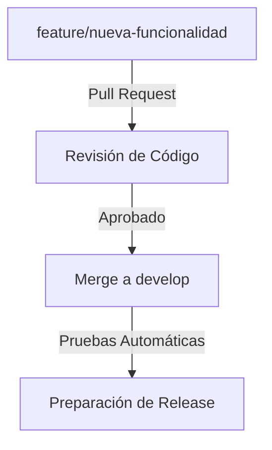

# 📄 BUENAS PRACTICAS EN COLABORACIÓN GIT

## 📌 **Introducción: ¿Por Qué Son Importantes las Buenas Prácticas en Git?**

En proyectos colaborativos, el uso adecuado de Git es clave para evitar conflictos, pérdidas de código y desorganización en el historial del repositorio.

📌 **Objetivos de este documento:**
✔️ **Establecer reglas para un flujo de trabajo eficiente.**  
✔️ **Evitar errores comunes al trabajar con ramas.**  
✔️ **Facilitar la revisión y validación del código antes de fusionarlo.**

---

## 🔄 **1️⃣ Flujo de Trabajo Recomendado para el Curso**

📌 **Para evitar conflictos y desorganización, seguimos este flujo de trabajo:**

1️⃣ **Cada funcionalidad se desarrolla en una rama `feature/*` creada desde `develop`**
   ```sh
   git checkout develop
   git pull origin develop
   git checkout -b feature/NOMBRE-DE-LA-FUNCIONALIDAD
   ```
2️⃣ **Al terminar, se crea un `Pull Request` en GitHub para revisión.**  
3️⃣ **Otro compañero revisa el código y aprueba la fusión a `develop`.**  
4️⃣ **Se ejecutan pruebas automáticas con GitHub Actions.**  
5️⃣ **Si todo está correcto, se fusiona la rama y se elimina.**
   ```sh
   git checkout develop
   git merge feature/NOMBRE-DE-LA-FUNCIONALIDAD
   git push origin develop
   git branch -d feature/NOMBRE-DE-LA-FUNCIONALIDAD
   ```

📌 **Ejemplo de flujo de trabajo en equipo:**


✅ **Ventajas de este flujo:**  
✔️ Permite trabajar sin afectar el código estable.  
✔️ Facilita la revisión de código antes de integrarlo.  
✔️ Evita conflictos al mantener ramas organizadas.

---

## 📌 **2️⃣ Reglas Básicas de Colaboración en GitHub**

📌 **1. Usa nombres descriptivos para las ramas**
- ✅ `feature/agregar-pagina-contacto`
- ❌ `cosas-nuevas`

📌 **2. No hagas `commit` directamente en `develop` o `main`**  
✅ Siempre usa una rama `feature/*` y realiza `Pull Requests` para fusionar cambios.

📌 **3. Escribe mensajes de `commit` claros y consistentes**  
Estructura recomendada:

```sh
git commit -m "feat(JIRA-123): Agregar funcionalidad de login con validaciones"
```

Ejemplos de etiquetas:

- `feat`: Nueva funcionalidad.
- `fix`: Corrección de errores.
- `docs`: Cambios en la documentación.
- `refactor`: Mejora de código sin cambiar funcionalidad.
- `test`: Agregar o modificar pruebas.
- `data`: Cambios en las cargas de datos iniciales de los entornos

📌 **Nota:** Incluye el identificador de la tarea en Jira (por ejemplo, `JIRA-123`) al inicio de cada mensaje de commit.

📌 **4. Antes de hacer `push`, sincroniza tu rama**
```sh
git pull --rebase origin develop
```
Esto evita conflictos con otros cambios en `develop`.

📌 **5. Revisa los `Pull Requests` de tus compañeros antes de aprobarlos**  
👀 No apruebes cambios sin revisarlos.

📌 **6. Después de fusionar una `feature`, elimínala**
```sh
git branch -d feature/nombre-rama
git push origin --delete feature/nombre-rama
```

---

## 🔍 **3️⃣ Cómo Hacer un Buen `Pull Request` (PR)**

📌 **Antes de crear un PR, asegúrate de:**  
✅ **Que tu código funciona correctamente (`mvn test`).**  
✅ **Que has sincronizado tu rama con `develop`.**  
✅ **Que tu código cumple con las reglas de estilo y buenas prácticas.**  
✅ **Que has añadido pruebas unitarias si es necesario.**

📌 **Pasos para hacer un `Pull Request` correctamente:**  
1️⃣ **Ir a GitHub > Pull Requests > New Pull Request.**  
2️⃣ **Seleccionar la rama `feature/*` y compararla con `develop`.**  
3️⃣ **Agregar un título descriptivo y una descripción clara.**  
4️⃣ **Asignar revisores del equipo.**  
5️⃣ **Esperar feedback antes de fusionar.**

---

## 🛠️ **4️⃣ ¿Cómo Resolver Conflictos de Fusión?**

📌 **Si GitHub detecta conflictos al intentar fusionar un `Pull Request`, debes resolverlos manualmente.**

📌 **Pasos para solucionar conflictos:**  
1️⃣ Cambiar a la rama que tiene conflictos:
```sh
git checkout feature/nombre-rama
```
2️⃣ Traer los últimos cambios de `develop`:
```sh
git pull origin develop
```
3️⃣ Git mostrará archivos en conflicto. Ábrelos y elige qué cambios mantener.  
4️⃣ Una vez resueltos, guarda y añade los cambios:
```sh
git add .
git commit -m "fix: Resolver conflictos en X archivo"
git push origin feature/nombre-rama
```
5️⃣ Ahora tu `Pull Request` estará listo para ser fusionado.

---

## 🎯 **Conclusión: Buenas Prácticas para un Desarrollo Colaborativo Exitoso**

✔️ **Trabajar en ramas `feature/*` y fusionar solo mediante `Pull Requests`.**  
✔️ **Escribir commits claros y organizados.**  
✔️ **Revisar código antes de aprobar fusiones.**  
✔️ **Mantener `develop` siempre estable y listo para despliegue.**  
✔️ **Eliminar ramas una vez fusionadas para mantener ordenado el repositorio.**

📌 **Siguiendo estas prácticas, el equipo trabajará de manera eficiente, evitando problemas y mejorando la calidad del código.** 🚀

---

⬅️ **Anterior: [10 - Integración Continua con GitHub Actions](10_INTEGRACION_CONTINUA_GITHUB_ACTIONS.md)**  
📌 **Siguiente: [12 - Resolución de Conflictos en Archivos Binarios](12_RESOLUCION_CONFLICTOS_BINARIOS.md) →**

